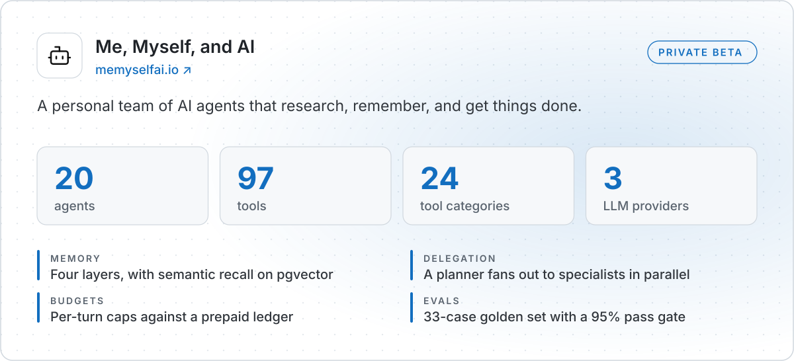
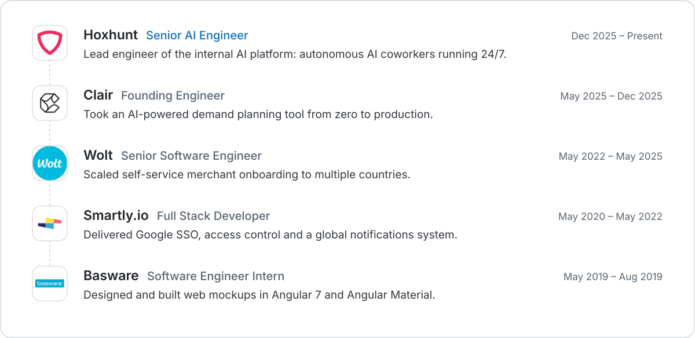
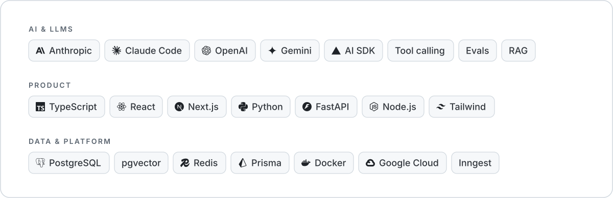

<a href="https://youssef.fi">
  <picture>
    <source media="(prefers-color-scheme: dark)" srcset="assets/header-dark.svg">
    
  </picture>
</a>

  <a href="https://youssef.fi"><picture><source media="(prefers-color-scheme: dark)" srcset="assets/btn-website-dark.svg"></picture></a>
  <a href="https://www.linkedin.com/in/youssef-mansour-760b27157/"><picture><source media="(prefers-color-scheme: dark)" srcset="assets/btn-linkedin-dark.svg"></picture></a>
  <a href="mailto:contact@youssef.fi"><picture><source media="(prefers-color-scheme: dark)" srcset="assets/btn-email-dark.svg"></picture></a>
  <a href="https://memyselfai.io"><picture><source media="(prefers-color-scheme: dark)" srcset="assets/btn-mmai-dark.svg"></picture></a>

### Now

<picture>
  <source media="(prefers-color-scheme: dark)" srcset="assets/now-hoxhunt-dark.svg">
  
</picture>

I work AI-first: agentic coding on governed workflows (merge governance, ticket-to-PR automation, multi-agent code review) to deliver production-grade systems.

### On the side

<a href="https://memyselfai.io">
  <picture>
    <source media="(prefers-color-scheme: dark)" srcset="assets/side-mmai-dark.svg">
    
  </picture>
</a>

<b>How it's engineered</b>

 

- **Memory:** four layers: always-injected core facts, semantic recall over pgvector embeddings, structured domain logs, and a global tier shared across agents. Older entries decay nightly.
- **Delegation:** a planner fans work out to specialist scouts in one parallel batch across live flight, hotel, maps and events APIs, reconciles their answers, then hands the write-up to a cheaper model.
- **Budgets:** usage metered per turn in millicents against a prepaid ledger, with daily and monthly limits, a $0.50 per-turn cap, and an emergency halt at 120% of the daily budget.
- **Evals:** the nutrition agent is scored against 33 checked-in cases and must clear 95% (32 of 33) to guard against prompt drift.
- **Cost:** prompt caching per call site, prompts split into stable and volatile halves, tool chains pruned past 90k tokens, sub-agents on cheaper models.
- **Channels:** voice with barge-in, WhatsApp, SMS, and scheduled agents that push results.

### Experience

<picture>
  <source media="(prefers-color-scheme: dark)" srcset="assets/experience-dark.svg">
  
</picture>

### Stack

<picture>
  <source media="(prefers-color-scheme: dark)" srcset="assets/stack-dark.svg">
  
</picture>

### What colleagues say

> He combines strong engineering fundamentals with curiosity, ownership, and a genuine drive to understand complex systems deeply. At Hoxhunt, he has consistently delivered high-quality work, improved our AI engineering practices, and responded exceptionally well to feedback.
>
> **Markus Hav**, Head of AI Automation, Hoxhunt

> He's a quick, solid executor. Give him a task, and you can trust that he'll get it done efficiently and with high quality.
>
> **Diego Casillas**, Engineering Team Lead, Wolt

Most of my work lives in private company repositories and shows here as private contributions.
